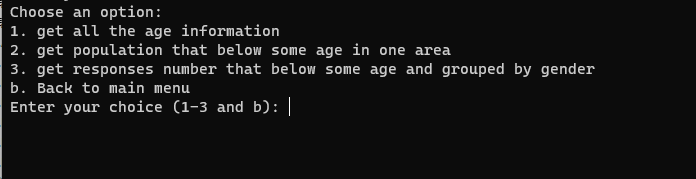
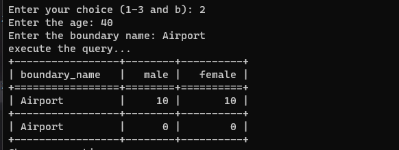

# Census Database For Winnipeg In 2006 And 2011
## Purpose
This project will let user to access the database to find some interesting data.

## Description
Our application comprises two components, a CLI that is used to query the database
and another application to insert the CSV data into the database

## Prerequisites
* Java and Python Installed
* A Windows Device

## Database Setup Instruction
1. Create a database using Microsoft Server SQL Management Studio called "group_project"  .  
(Note: If you already have this database, please delete the current one and create a new one)  
2. For importing the CSV files into the database there is a Java application that uses
Gradle and Java 17 while assuming that you have the auth dll setup for security.  

The path to the COMP_3380_Project needs to be set on line 17,  
```java
private static final String PATH =
      "C:/Users/Bruce/IdeaProjects/COMP_3380_Project";
```
and then that PATH should be directory were COMP_3380_Project is.

On line 19 There is a file that contains the connection string for interacting with the
database please modify it to your environment.  
```java
    final var connectionUrl=
    "jdbc:sqlserver://localhost\\SQLEXPRESS:1433;"
    +"database=group_project;"
    +"integratedSecurity=true;"
    +"encrypt=true;"
    +"trustServerCertificate=true;"
    +"loginTimeout=30;";
```

After the connection string is modified then the inserting can take place in the database by
calling.

```bash
./gradlew :app:run
```

** Note since the tool is designed against using relative paths there is a chance that it fails to
import the data within your environment with that we've provided an SQL Script to apply against your database to get the data imported.
**
## Use Client Instruction
This is the CLI application which is written in Python that allows for easy querying   of the database and provides many analytic driven queries. It assumes that you are
running on a windows based host.
1. Find the "command.exe", and double click to run it.  
(Note: If you can't run command.exe, you can run "python command.py" in your terminal. Make sure you intalled "tabulate" package)
2. Choose an option by type different number.  
  
3. Each option contain more options, and you can enter "b" to go back to main menu  
  
4. Some options will give you the result directly, some options require you to input something. After you input the required data, you will get the result in table form.  
  
  
  
Source code is also provided if any issues arise.

Thank you.