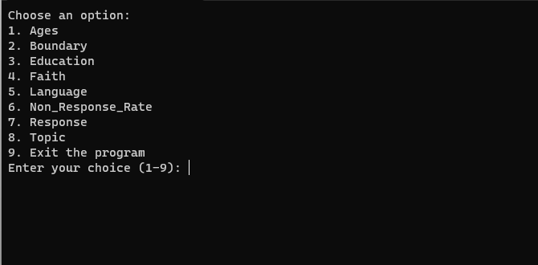
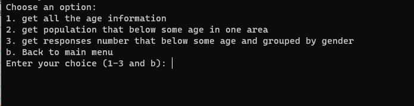
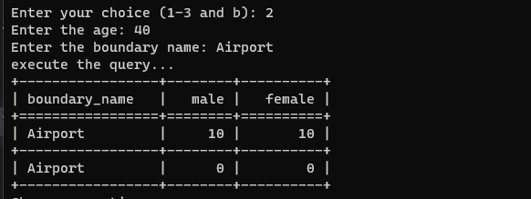

# Census Database For Winnipeg In 2006 And 2011
## Purpose
This project will let user to access the database to find some interesting data.

## Prerequisites
* Java and Python Installed
* A Windows Device
* 

## Instruction
1. Create a database using Microsoft Server SQL Management Studio called "group_project"  .  
(Note: If you already have this database, please delete the current one and create a new one)  
2. Use intellij idea to open "COMP_3380_Project" as a project.
3. Build it and run "app.java" to inject data.
4. Find the "command.exe", and double click to run it.
5. Choose an option by type different number.  
  
6. Each option contain more options, and you can enter "b" to go back to main menu  
  
7. Some options will give you the result directly, some options require you to input something. After you input the required data, you will get the result in table form.  
